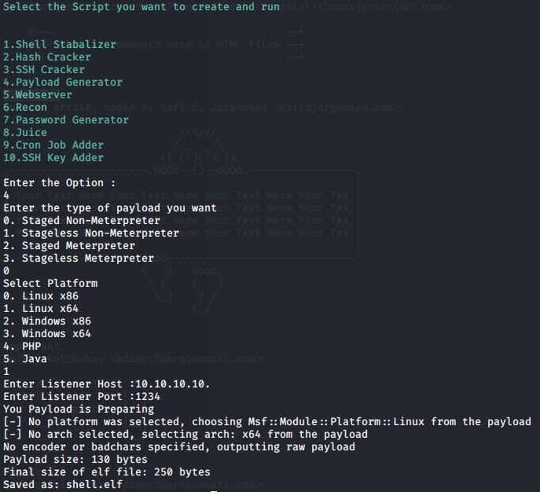
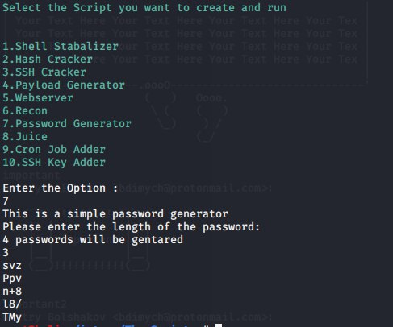

# The_Scripter
The_Scripter is tools for making pentesting easy. It contains lots of automation scripts like hash cracker, ssh_cracker,etc.
The Scripter will help to automate many tasks without remembering all the commands and with simple command line interface.

**Installation**

To install the tool first clone the tool from the github repo.
Then cd to the_scripter dir.
Then run install.sh file

**How to Run**

To run the tool run the_scripter.sh file and it will give you all the options to run the scripts from there you can choose the script which you like to run

## 1. Payload Generator
The Payload Generator script will help to generate different types of payloads according to you.
This Script will give options to select the type of payload and the platform for which you needed the payload.

## 2. SSH Cracker
This script will contain code for cracking id_rsa key using John The Ripper.
It will make id_rsa executable and crack it’s password . It will also detect id_rsa is openkey or private key .
This script will also have option for bruteforcing ssh username.

